# Лабораторная работа 1
## Задание 1

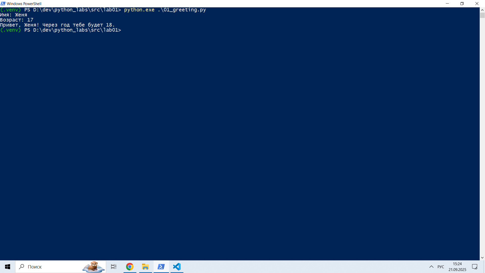


## Задание 2

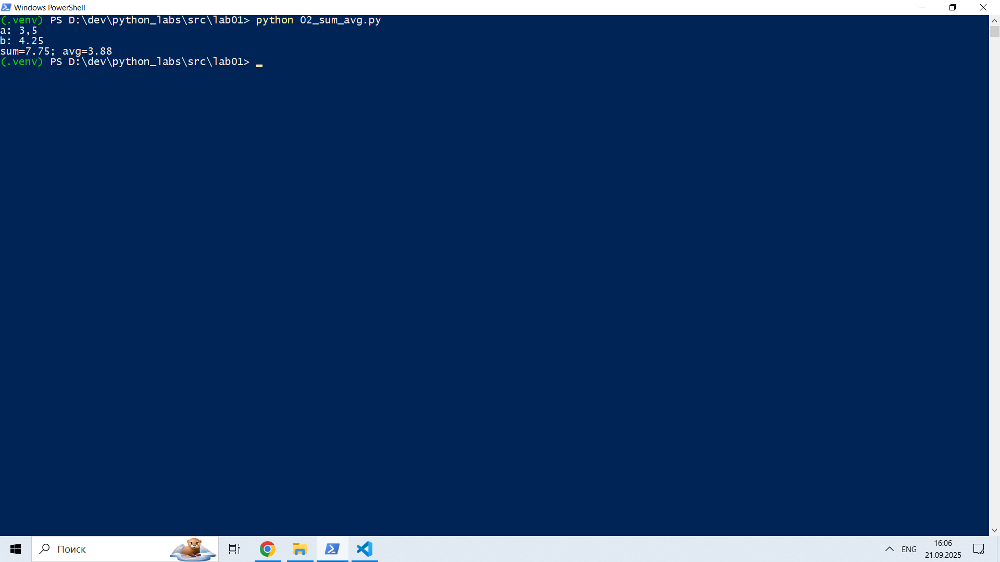


## Задание 3

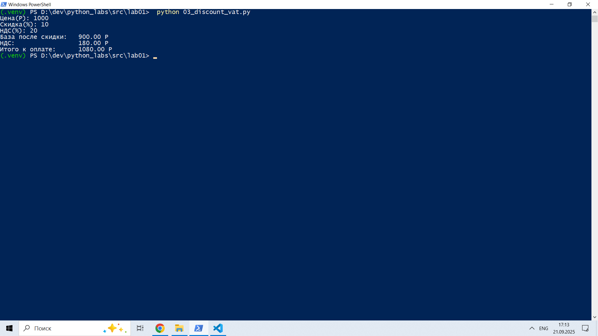


## Задание 4

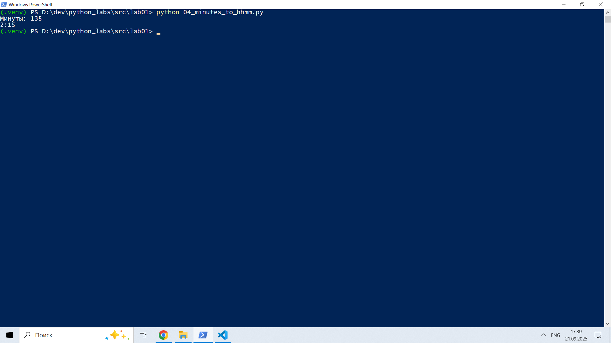


## Задание 5

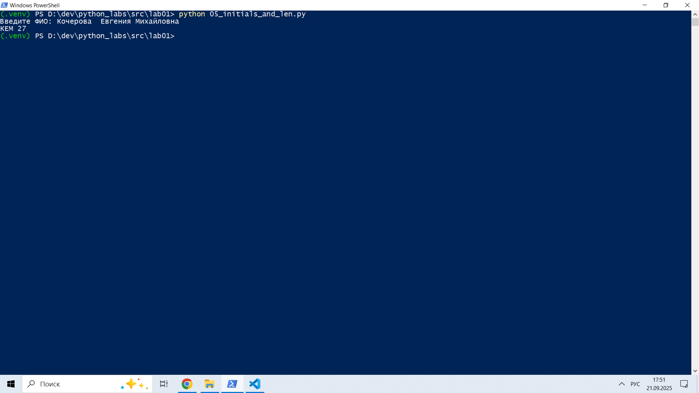


# Лабораторная работа 2
## Задание 1 — arrays.py
В первом задании я реализую 3 функции: поиск минимума и максимума в списке, сортировка списка по возрастанию и удаление дубликатов, «расплющивание» списка списков/кортежей в один список по строкам.
Вот код к этому заданию.

```
#1
print("задача 1")

def min_max(nums):
    """Эта функция возвращает минимум и максимум из списка.
    Например, [3, -1, 5, 5, 0] -> (-1, 5)"""
    return (min(nums), max(nums))

#2
print("")
print("задача 2")

def unique_sorted(nums):
    """
    Эта функция сортирует значения по возрастанию и убирает дубликаты.
    Например, [3, -1, 5, 5, 0] → (-1, 5)
    """
    return sorted(set(nums))

#3
print("")
print("задача 3")

def flatten0(mat, b):
    """
    Эта функция реализует flatten через рекурсию 
    """
    # print(f'mat={mat}, b={b}')
    for a in mat:
        if type(a) == list:
            flatten0(a, b)
        elif type(a) == tuple:
            flatten0(a, b)
        else:
            if type(a) == str:
                raise TypeError()
            b.append(a)
def flatten(mat):
    """
    Эта функция делает "расплющивание" массива: из вложенного делает плоским
    """
    b = []
    flatten0(mat, b)
    return b
```
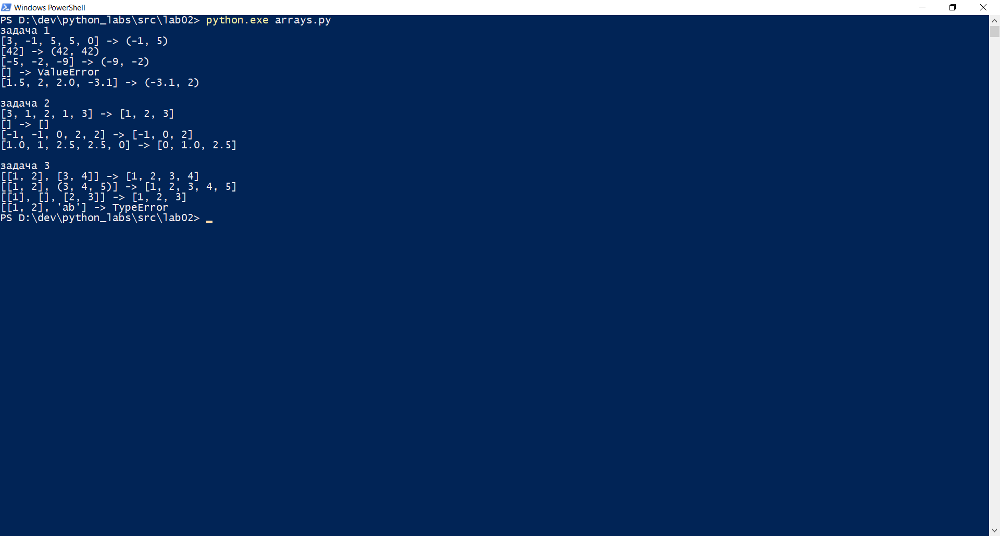


## Задание 2 - matrix.py
Во втором задании я реализую 3 функции: в матрице меняю строки и столбцы местами, вычисляю сумму по каждой строке, вычисляю сумму по каждому столбцу.
Вот код к этому заданию.

```
#1
print("задача 1")

def transpose(mat):
    """
    Эта функция меняет строки и столбцы местами.
    """
    t_mat = []
    cnt_strok = len(mat) 
    
    if cnt_strok == 0:
        return []
    
    cnt_stl = len(mat[0]) 
    
    for i in range(cnt_stl):
        row = []
        for i in range(cnt_strok):
            row.append(0)

        t_mat.append(row)

    for i in range(cnt_strok):
        for j in range(cnt_stl):
            stroka = mat[i]

            if cnt_stl != len(stroka):
                raise ValueError()
            y = stroka[j]
            t_mat [j][i] = y
    
    return t_mat

#2
print("")
print("задача 2")

def row_sums(mat):
    """
    Эта функция считает сумму в каждой строке матрицы.
    """
    sum_el = []
    cnt_strok = len(mat)
    if cnt_strok == 0:
        return []
    cnt_stl = len(mat[0]) 
    for i in range(cnt_strok):
        sum_el.append(0)
    for i in range(cnt_strok):
        if cnt_stl != len(mat[i]):
            raise ValueError()
        s = 0
        for j in mat[i]:
            s += j
        sum_el[i] = s
    return sum_el

#3
print("")
print("задача 3")

def col_sums(mat):
    """
    Эта функция считает сумму всех столбцов матрицы.
    """
    sum_el = []
    cnt_strok = len(mat)
    
    if cnt_strok == 0:
        return []
    
    cnt_stl = len(mat[0]) 

    for stroka in mat:
        if len(stroka) != cnt_stl:
            raise ValueError()
        
    for i in range(cnt_stl):
        sum_el.append(0)

    for i in range(cnt_strok):
        for j in range(cnt_stl):
            sum_el[j] += mat[i][j]
    
    return sum_el
```
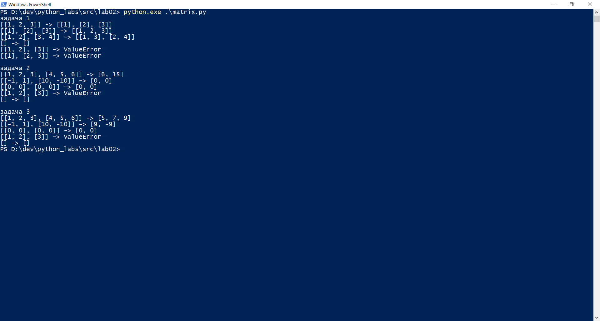


## Задание 3 - tuples.py
В третьем задании я работаю с «записями» как с кортежами. Я реализую функцию, которая создает текстовое описания кортежа с данными о студенте.
Вот код к этому заданию.

```
def get_initials(full_name):
    """
    Эта функция из полного фио делает фамилию + инициалы.
    Например, Иванов Иван Иванович -> Иванов И.И.
    """

    cleaned = ' '.join(full_name.split())
    parts = cleaned.split(' ')
    s = ''
    if len(parts) == 1:
        raise ValueError("неполностью задано фио")
    if len(parts) > 3:
        raise ValueError("Неправильно количество элементов")
    for i in range(len(parts)):
        if i == 0:
            s += parts[i][0].upper() + parts[i][1:] + " "
        else:
            s += parts[i][0].upper() + "."
    return s

def format_record(rec: tuple[str, str, float]) -> str:
    """
    Эта функция создает текстовое описания кортежа с данными о студенте.
    Например, ('Иванов Иван Иванович', 'BIVT-25', 4.6) -> Иванов И.И., гр. BIVT-25, GPA 4.60
    """
    if type(rec) != tuple:
        raise TypeError("неверный тип входных данных")
    fio = rec[0].strip()
    group = rec[1].strip()
    gpa = rec[2]
    if fio == "":
        raise ValueError("fio пустое")
    if group == "":
         raise ValueError("group пустое")
    if type(gpa) != float:
        raise TypeError("неправильный тип данных gpa")
    
    s = f'{get_initials(fio)}, гр. {group}, GPA {gpa:.2f}'

    return s
```
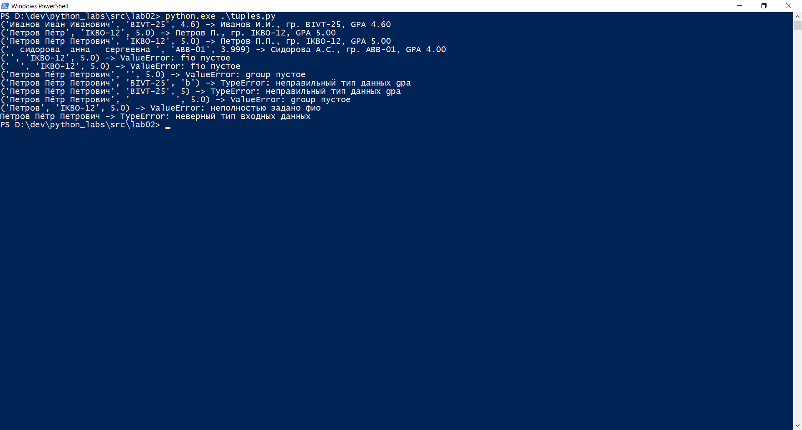


# Лабораторная работа 1
## Задание 1


## Задание 2


## Задание 3


## Задание 4


## Задание 5


# Лабораторная работа 3
## Задание A — src/lib/text.py
В первом задании я реализую 4 функции: "очистка" текста, разделение входного текста на список слов по небуквенно-цифровым разделителям, подсчет частоты появления каждого слова в списке и  возврат списка из n самых частых слов.
Вот код к этому заданию.

```
def normalize(text: str, *, casefold: bool = True, yo2e: bool = True) -> str:
    """
    Эта функция "очищает" текст: приводит к нижнему регистру, заменяет ё на е, убирает лишние управляющие символы и пробелы.
    """
    if casefold:
        s = text.casefold()
    else:
        s = text
    res = []
    words = s.split()
    for word in words:
        new_word = ""
        for i in range(len(word)):
            if yo2e and word[i] == "ё":
                new_word += "е"
            else:
                new_word += word[i]
        res.append(new_word)
    
    return " ".join(res)

def is_word_symb(symb):
    """
    Эта функция проверяет, является ли символ допустимым для слова.
    """
    return symb.isalpha() or symb.isdigit() or symb == "_"

def tokenize(text: str) -> list[str]:
    """
    Эта функция разбивает входной текст на список слов по небуквенно-цифровым разделителям.
    """
    res = ""
    for i in range(len(text)):
        s = text[i]
        if is_word_symb(s):
            res += s
        elif s == "-":
            x = " "

            if i > 0 and i < len(text) - 1:
                f = text[i-1]
                a = text[i+1]
                if is_word_symb(f) and is_word_symb(a):
                    x = s
            
            res += x
        else:
            res += " "
    return res.split()


def count_freq(tokens: list[str]) -> dict[str, int]:
    """
    Эта функция подсчитывает частоту появления каждого слова в списке.
    """
    my_dict = {}
    for i in tokens:
        if i in my_dict:
            my_dict[i] += 1
        else:
            my_dict[i] = 1
    return my_dict

def top_n(freq: dict[str, int], n: int = 5) -> list[tuple[str, int]]:
    """
    Эта функция возвращает список из n самых частых слов.
    """
    def my_sort(elem):
        return(-elem[1], elem[0])
    
    res = sorted(freq.items(), key=my_sort)
    return res[:n]

```
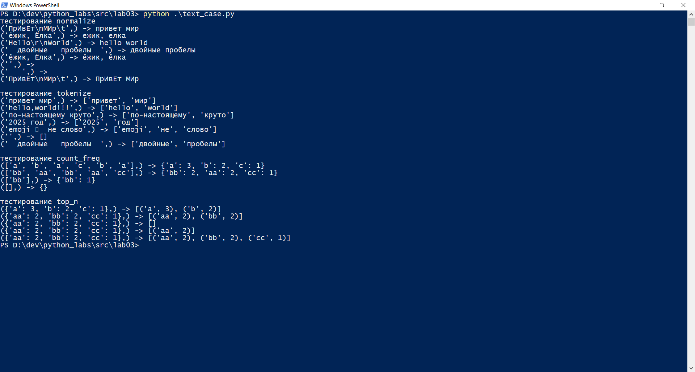


## Задание b - src/text_stats.py
Во втором задании скрипт читает одну строку текста из stdin, вызывает функции из lib/text.py и печатает:
Всего слов: <N>
Уникальных слов: <K>
Топ-5: — по строке на запись в формате слово:кол-во (по убыванию, как в top_n).

Вот код к этому заданию.

```
import sys
sys.path.append("../lib")
from text import *

text = input()
norm_text = normalize(text)
tokenz = tokenize(norm_text)
freqs = count_freq(tokenz)
top_5 = top_n(freqs, n=5)
print(f"Всего слов: {len(tokenz)}")
print(f"Уникальных слов: {len(freqs.keys())}")
print(f"Топ-5:")
for i in top_5:
    print(f"{i[0]}:{i[1]}")
```
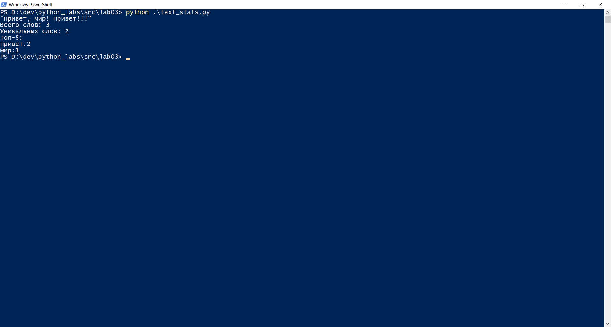


# Лабораторная работа 4
## Задание A — модуль src/lab04/io_txt_csv.py

В этом задании я реаизовала функции read_text и write_csv. Первая функция считывает текст, а вторая создает csv-файл.
Вот код к этому заданию.

```
from pathlib import Path

def read_text(path: str | Path, encoding: str = "utf-8") -> str:
    """
    Эта функция читает текст. Для выбора другой кодировки используйте аргумент encoding. Например encoding = "cp1251".
    Сейчас содержимое файла считывается целиком и вовзращается в одной переменной, но в реальных задачах нужно сделать 
    построчную обработку информации, иначе может не хватить памяти.
    """
    p = Path(path)
    # FileNotFoundError и UnicodeDecodeError пусть «всплывают» — это нормально
    return p.read_text(encoding=encoding)

import csv
from pathlib import Path
from typing import Iterable, Sequence

def write_csv(rows: Iterable[Sequence], path: str | Path,
              header: tuple[str, ...] | None = None, encoding: str = "utf-8") -> None:
    """
    Эта функция создает csv-файл, в который записывает заголовок (если есть), а потом строки данных.
    Для выбора другой кодировки используйте аргумент encoding. Например encoding = "cp1251".
    """
    p = Path(path)
    rows = list(rows)
    if len(rows) != 0:
        cnt_elem = len(rows[0])
    else:
        cnt_elem = 0
    with p.open("w", newline="", encoding=encoding) as f:
        w = csv.writer(f)
        if header is not None:
            w.writerow(header)
        for r in rows:
            if len(r) != cnt_elem:
                raise ValueError()
            w.writerow(r)
```

Написала тест-кейсы в отдельном файле test_io_txt_csv.py. Вот он:


```
import csv
import os
from io_txt_csv import read_text, write_csv

print("проверка, что возвращается одна строка")
txt2 = read_text("../../data/lab04/input2.txt")
assert type(txt2) == str

print("проверка, что если файл не найден — поднимается FileNotFoundError")
try:
    read_text("../../data/lab04/input3.txt")
    assert False
except FileNotFoundError:
    print("read_txt вызван для несуществующего файла, поймано исключение FileNotFoundError, как и ожидалось ")

print("проверка, что если кодировка не та, поднимается UnicodeDecodeError")
try:
    read_text("../../data/lab04/test-cp1251.txt", encoding = "utf-8")
    assert False
except UnicodeDecodeError:
    print("указана кодировка utf-8, а файл записан в кодировке cp1251, поймано исключение UnicodeDecodeError, как и ожидалось")

print("проверка, что при обработке пустого файла выведется пустая строка")
txt_em = read_text("../../data/lab04/empty_file.txt")
assert txt_em == ""

print("проверка, что csv-файл создается с разделителем запятая")
write_csv([("word","count"),("test",3)], "../../data/lab04/check01.csv")
with open("../../data/lab04/check01.csv") as f:
    r = csv.reader(f, delimiter=",")
    for row in r:
        assert len(row) == 2

print("проверка, что если передан header, то он запишется первой строкой")
write_csv([("word","count"),("test",3)], "../../data/lab04/check02.csv", header=("h1", "h2"))
with open("../../data/lab04/check02.csv") as f:
    r = csv.reader(f)
    for row in r:
        assert row == ["h1",  "h2"], row
        break

print("проверка, что все строки имеют одинаковую длину, а если нет, то поднимается ValueError")
try:
    write_csv([("word","count"),("test",3, "elem1")], "../../data/lab04/check03.csv")
    assert False
except ValueError:
    print("write_csv вызвано со строчками разной длины, перехвачено ValueError, как и ожидалось")

print("проверка, что если rows пустой, то формируется пустой csv файл")
write_csv([], "../../data/lab04/check04.csv")
txt3 = read_text("../../data/lab04/check04.csv")
assert txt3 == ""

print("проверка, что если файл с header=(a,b), то файл содержит только заголовок")
write_csv([], "../../data/lab04/check05.csv", header=("a", "b"))
with open("../../data/lab04/check05.csv") as f:
    r = csv.reader(f)
    for row in r:
        assert row == ["a", "b"] 

```
### Вот результат их выполения:

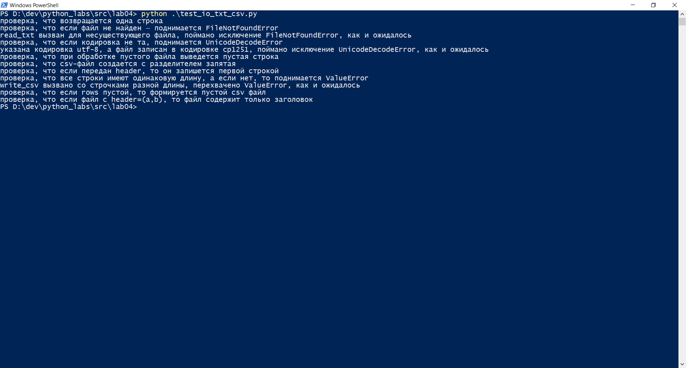


## Задание b - скрипт src/lab04/text_report.py
Написала скрипт, который:  
- Читает один входной файл data/input.txt (сейчас название файла с входынми данными хранится в переменной f_name).  
- Нормализует текст (lib/text.py), токенизирует и считает частоты слов.  
- Сохраняет data/report.csv c колонками: word,count, отсортированными: count ↓, слово ↑ (при равенстве).  
- В консоль печатает краткое резюме:  
Всего слов: N  
Уникальных слов: K  
Топ-5:   
- Также есть переменные, которые управляют кодировкой входного файла и csv-отчета: input_encoding и output_encoding.

Вот код к этому заданию:

```
import sys
sys.path.append("../lib")
from text import *
from io_txt_csv import read_text, write_csv
# f_name = "../../data/lab04/input.txt"
# f_name = "../../data/lab04/empty_file.txt"
f_name = "../../data/lab04/test-cp1251.txt"
# input_encoding = "utf-8"
input_encoding = "cp1251"
# output_encoding = "utf-8"
output_encoding = "cp1251"
try:
    text = read_text(f_name, encoding=input_encoding)
except FileNotFoundError:
    print(f"Файла {f_name} не существует")
    sys.exit(1)


norm_text = normalize(text)
tokenz = tokenize(norm_text)
freqs = count_freq(tokenz)
top_5 = top_n(freqs, n=5)

rows = freqs.items()

def my_sort(elem):
    return(-elem[1], elem[0])

rows = sorted(rows, key=my_sort)
write_csv(rows, "../../data/lab04/report.csv", encoding = output_encoding, header=("word", "count"))

print(f"Всего слов: {len(tokenz)}")
print(f"Уникальных слов: {len(freqs.keys())}")
print(f"Топ-5:")
for i in top_5:
    print(f"{i[0]}:{i[1]}")
```
### Пример запуска с обычным файлом:

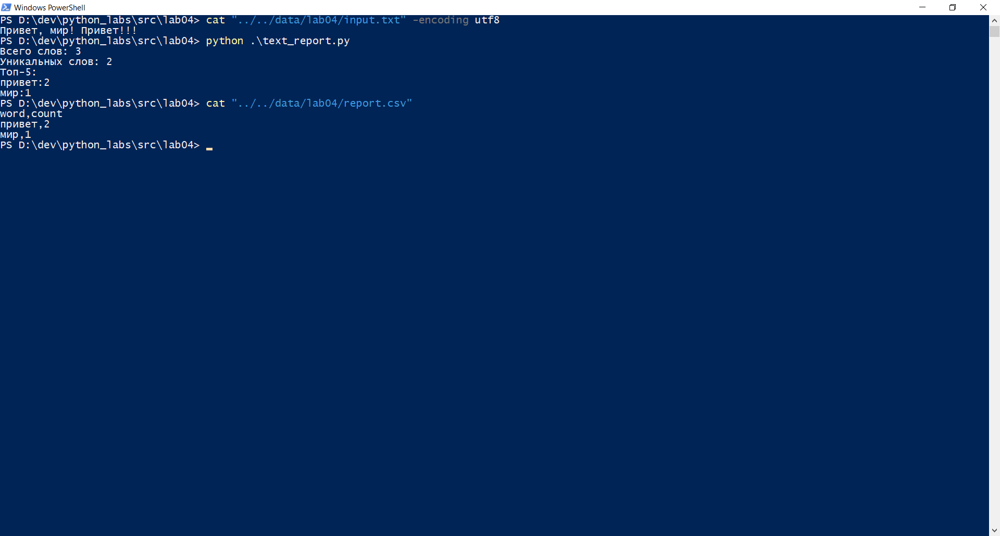

### Пример запуска с пустым файлом:

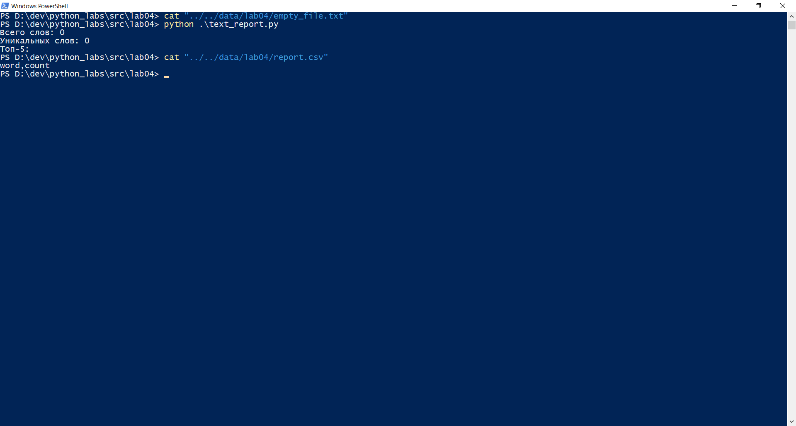

### Пример запуска с кодировкой cp1251:

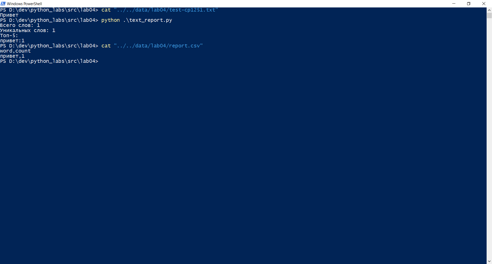

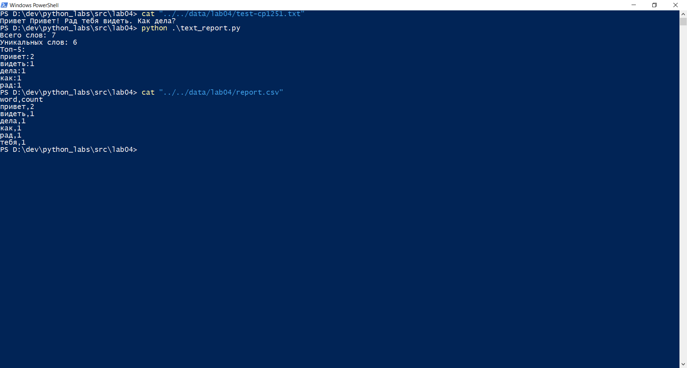


# Лабораторная работа 5
## Задание A — JSON ↔ CSV
Реализовала модуль src/lab05/json_csv.py с функциями, преобразующими json-файл в csv и csv-файл в json.
Вот код к этому заданию:
```
import csv
import json      

def get_json_as_rows(json_path: str):
    """
    Читает содержимое json-файла и возвращает его в виде набора строк.
    """
    with open(json_path, newline="", encoding="utf-8") as f:
        return json.load(f)
    

def get_csv_as_rows(f_name):
    """
    Читает содержимое csv-файла и возвращает его в виде набора строк.
    """
    with open(f_name, newline="", encoding="utf-8") as f:
        reader = csv.reader(f)
        rows = []
        for row in reader:
            rows.append(row)
        return rows 

    
def json_to_csv(json_path: str, csv_path: str) -> None:
    """
    Преобразует JSON-файл в CSV.
    Поддерживает список словарей [{...}, {...}], заполняет отсутствующие поля пустыми строками.
    Кодировка UTF-8. Порядок колонок — как в первом объекте.
    """
     if not json_path.endswith('.json'):
        raise ValueError("Неверный тип файла, файл должен иметь расширение json")

    with open(json_path, encoding="utf-8", newline="") as f:
        try:
            rows = json.load(f)
        except json.decoder.JSONDecodeError:
            raise ValueError("некорректный формат json-файла")
        
    if len(rows) == 0:
        raise ValueError("файл json пустой")
    
    with open(csv_path, "w", newline="", encoding="utf-8") as f:
        fieldnames=rows[0].keys()
        w = csv.DictWriter(f, fieldnames=fieldnames)
        w.writeheader()

        for row in rows:
            w.writerow(row)


def csv_to_json(csv_path: str, json_path: str) -> None:
    """
    Преобразует CSV в JSON. Значения сохраняются как строки.
    """
    if not csv_path.endswith('.csv'):
        raise ValueError("Неверный тип файла, файл должен иметь расширение csv")
        
    rows = []
    
    with open(csv_path, newline="", encoding="utf-8") as f:
        reader = csv.DictReader(f)
        for row in reader:
            rows.append(row)

    if len(rows) == 0:
        raise ValueError("файл-csv пустой")

    with open(json_path, "w", newline='', encoding="utf-8") as f:
        json.dump(rows, f, ensure_ascii=False, indent=2)
```
### Вот результат выполнения на тест-кейсах:

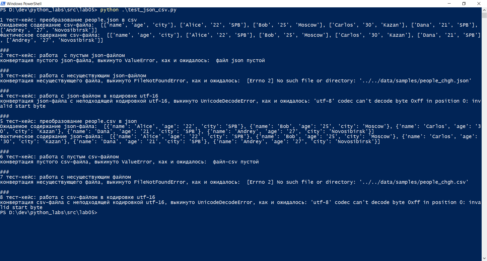

## Задание B — CSV -> XLSX

Реализовала модуль src/lab05/csv_xlsx.py, который конвертирует csv-файл в xlsx.
Вот код к этому заданию:

```
from openpyxl import Workbook
from json_csv import *

def csv_to_xlsx(csv_path: str, xlsx_path: str) -> None:
    """
    Конвертирует CSV в XLSX. Колонки — автоширина по длине текста.
    """
    if not csv_path.endswith('.csv'):
        raise ValueError("неверный тип файла, файл должен иметь расширение .csv")
    
    rows = get_csv_as_rows(csv_path)

    if not rows:
        raise ValueError('csv-файл пустой')

    wb = Workbook()
    ws = wb.active
    ws.title = "Sheet1"

    for row in rows:
        ws.append(row)

    for col in ws.columns:
        max_length = 0
        column = col[0].column_letter 
        for cell in col:
            try:  
                if len(str(cell.value)) > max_length:
                    max_length = len(str(cell.value))
            except:
                pass
        if max_length < 8:
            max_length = 8

# Рассчитываем ширину колонки:
# добавляем 2 символа к максимальной длине, чтобы оставить небольшой отступ,
# и умножаем на 1.2 для более эстетичного отображения

        adjusted_width = (max_length + 2) * 1.2
        ws.column_dimensions[column].width = adjusted_width # Устанавливаем ширину текущей колонки равной рассчитанному значению

    wb.save(xlsx_path)
```

### Вот результат его выполнения на тест-кейсах:
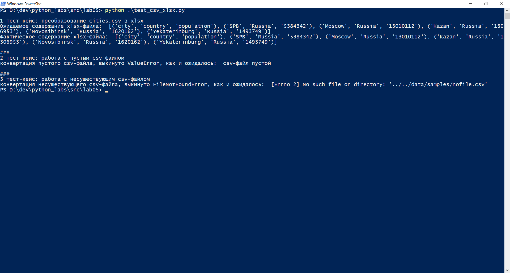

### Вот файл cities.xlsx после обработки:
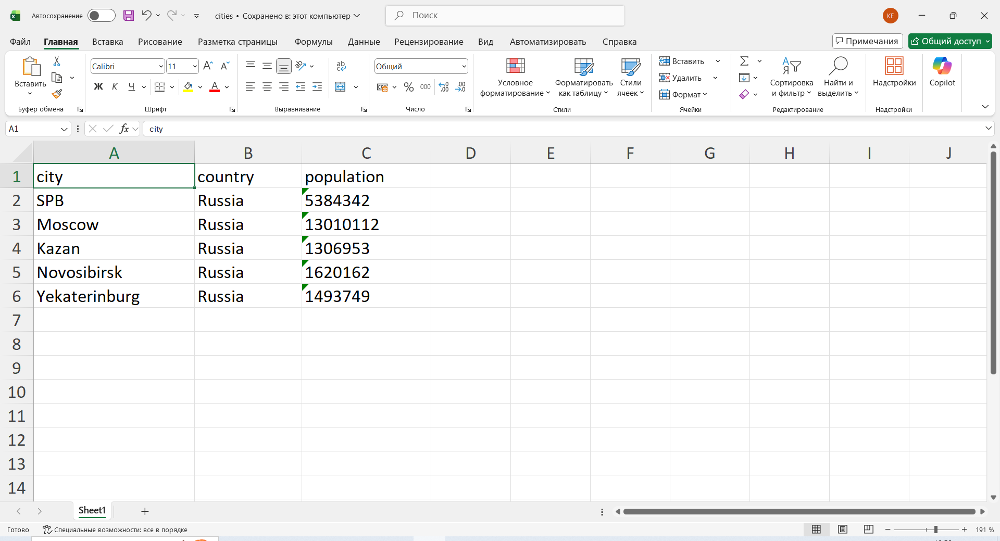

### Вот файл people.xlsx после обработки:
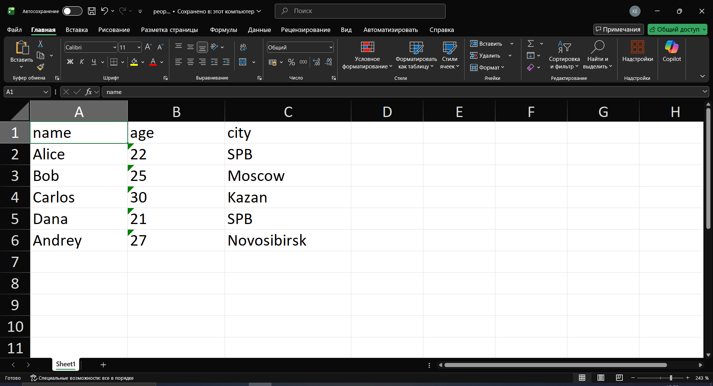


# Лабораторная работа 6
## 1

Реализовала модуль src/lab06/cli_text.py с подкомандами:

stats --input <txt> [--top 5] — анализ частот слов в тексте;  
cat --input <path> [-n] — вывод содержимого файла построчно.

Вот код к этому заданию:
```
import argparse
import sys
sys.path.append("../lib")
from text import * 

def main():
    parser = argparse.ArgumentParser(description="CLI‑утилиты лабораторной №6")
    sub = parser.add_subparsers(dest="cmd")

    cat_parser = sub.add_parser("cat", help="Вывести содержимое файла")
    cat_parser.add_argument("--input", required=True, help="Имя входного файла со словами")
    cat_parser.add_argument("-n", action="store_true", help="Нумеровать строки")

    stats_parser = sub.add_parser("stats", help="Частоты слов")
    stats_parser.add_argument("--input", required=True, help="Имя входного файла со словами")
    stats_parser.add_argument("--top", type=int, default=5, help="Количество самых частых слов, которые нужно вывести")

    args = parser.parse_args()

    try:
        if args.cmd == "stats":
            with open(args.input, 'r', encoding='utf-8') as f:
                text = f.read()
            norm_text = normalize(text)
            tokenz = tokenize(norm_text)
            freqs = count_freq(tokenz)
            top_n1 = top_n(freqs, n=args.top)
            
            for i in top_n1:
                print(f"{i[0]}:{i[1]}")
        elif args.cmd == "cat":
            with open(args.input, 'r', encoding='utf-8') as f:
                cnt = 1
                for line in f:
                    s = line.rstrip()

                    if args.n:
                        s = f'{cnt}: {s}'
                        cnt += 1

                    print(s)
    except FileNotFoundError:
        print(f"файл \"{args.input}\" не найден")
        sys.exit(1)

if __name__ == "__main__":
    main()
```
### Вот результат работы команды cat:

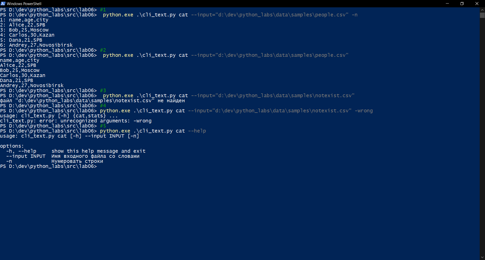

### Вот результат работы команды stats:

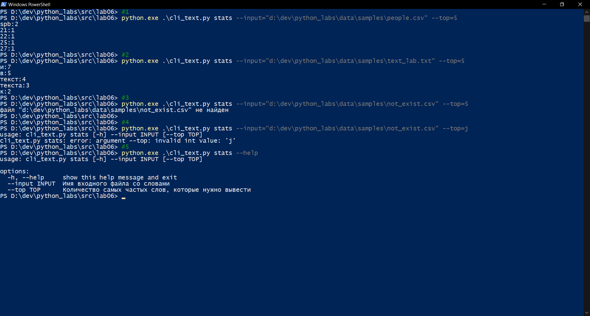

## 2

Реализовала модуль src/lab06/cli_convert.py с подкомандами:

json2csv --in data/samples/people.json --out data/out/people.csv - преобразование json файла в csv  
csv2json --in data/samples/people.csv --out data/out/people.json - преобразование csv файла в json   
csv2xlsx --in data/samples/people.csv --out data/out/people.xlsx - преобразование csv файла в xlsx    

Вот код к этому заданию:

```
import argparse
import sys
sys.path.append("../lab05")
from json_csv import json_to_csv, csv_to_json
from csv_xlsx import csv_to_xlsx

def main():

    parser = argparse.ArgumentParser(description="Конвертеры данных")
    sub = parser.add_subparsers(dest="cmd")

    p1 = sub.add_parser("json2csv", help="Конвертировать из json в csv")
    p1.add_argument("--in", dest="input", required=True, help="Входной json файл")
    p1.add_argument("--out", dest="output", required=True, help="Итоговый csv файл")

    p2 = sub.add_parser("csv2json", help="Конвертировать из csv в json")
    p2.add_argument("--in", dest="input", required=True, help="Входной csv файл")
    p2.add_argument("--out", dest="output", required=True, help="Итоговый json файл")

    p3 = sub.add_parser("csv2xlsx", help="Конвертировать из csv в xlsx")
    p3.add_argument("--in", dest="input", required=True, help="Входной csv файл")
    p3.add_argument("--out", dest="output", required=True, help="Итоговый xlsx файл")

    args = parser.parse_args()

    try:
        if args.cmd == "json2csv":
            json_to_csv(args.input, args.output)
        elif args.cmd == "csv2json":
            csv_to_json(args.input, args.output)
        else:
            csv_to_xlsx(args.input, args.output)
    except FileNotFoundError:
        print(f"файл \"{args.input}\" не найден")
        sys.exit(1)

if __name__ == "__main__":
    main()
```

### Вот выполнения всех подкоманд:
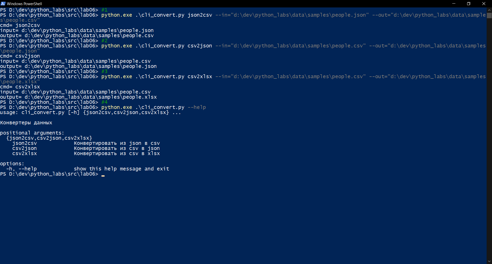

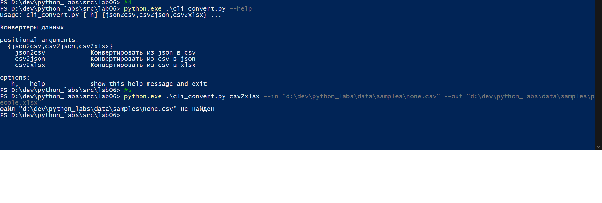


# Лабораторная работа 7
## A. Тесты для src/lib/text.py

Написала автотесты для всех публичных функций модуля:

* normalize(text: str) -> str
* tokenize(text: str) -> list[str]
* count_freq(tokens: list[str]) -> dict[str, int]
* top_n(freq: dict[str, int], n: int) -> list[tuple[str, int]]

Вот код к этому заданию:
```
import pytest
import sys

sys.path.append("../src/lib")
from text import *


@pytest.mark.parametrize(
    "source,expected",
    [
        ("ПрИвЕт\nМИр\t", "привет мир"),
        ("ёжик, Ёлка", "ежик, елка"),
        ("Hello\r\nWorld", "hello world"),
        ("  двойные   пробелы  ", "двойные пробелы"),
        ("", ""),
        ("   ", ""),
    ],
)
def test_normalize(source, expected):
    assert normalize(source) == expected


@pytest.mark.parametrize(
    "source, expected",
    [
        ("привет мир", ["привет", "мир"]),
        ("hello,world!!!", ["hello", "world"]),
        ("по-настоящему круто", ["по-настоящему", "круто"]),
        ("2025 год", ["2025", "год"]),
        ("emoji 😀 не слово", ["emoji", "не", "слово"]),
        ("", []),
        ("  двойные   пробелы  ", ["двойные", "пробелы"]),
    ],
)
def test_tokenize_basic(source, expected):
    assert tokenize(source) == expected


@pytest.mark.parametrize(
    "tokens, expected",
    [
        (["a", "b", "a", "c", "b", "a"], {"a": 3, "b": 2, "c": 1}),
        (["bb", "aa", "bb", "aa", "cc"], {"aa": 2, "bb": 2, "cc": 1}),
        (["bb"], {"bb": 1}),
        ([], {}),
    ],
)
def test_count_freq_and_top_n(tokens, expected):
    assert count_freq(tokens) == expected


@pytest.mark.parametrize(
    "freq, n, expected",
    [
        ({"a": 3, "b": 2, "c": 1}, 2, [("a", 3), ("b", 2)]),
        ({"aa": 2, "bb": 2, "cc": 1}, 2, [("aa", 2), ("bb", 2)]),
        ({"aa": 2, "bb": 2, "cc": 1}, 0, []),
        ({"aa": 2, "bb": 2, "cc": 1}, 1, [("aa", 2)]),
        ({"aa": 2, "bb": 2, "cc": 1}, 10, [("aa", 2), ("bb", 2), ("cc", 1)]),
    ],
)
def test_top_n(freq, n, expected):
    assert top_n(freq, n) == expected

```

## B. Тесты для src/lab05/json_csv.py

Написала автотесты для функций:

* json_to_csv(src_path: str, dst_path: str)
* csv_to_json(src_path: str, dst_path: str)

Вот код к этому заданию:

```
import pytest
import csv
import json
from pathlib import Path
import sys

sys.path.append("../src/lab05")
from json_csv import *


# 1
def test_json_to_csv_roundtrip(tmp_path: Path):
    src = tmp_path / "people.json"
    dst = tmp_path / "people.csv"
    data = [
        {"name": "Alice", "age": 22},
        {"name": "Bob", "age": 25},
    ]
    src.write_text(json.dumps(data, ensure_ascii=False, indent=2), encoding="utf-8")
    json_to_csv(str(src), str(dst))

    with dst.open(encoding="utf-8") as f:
        rows = list(csv.DictReader(f))

    assert len(rows) == 2
    assert {"name", "age"} <= set(rows[0].keys())


# 2
def test_csv_to_json_roundtrip(tmp_path: Path):
    src = tmp_path / "people.csv"
    dst = tmp_path / "people.json"
    data = """name,age,city
Alice,22,SPB
Bob,25,Moscow
Carlos,30,Kazan
Dana,21,SPB
Andrey,27,Novosibirsk
"""
    expected = [
        {"name": "Alice", "age": "22", "city": "SPB"},
        {"name": "Bob", "age": "25", "city": "Moscow"},
        {"name": "Carlos", "age": "30", "city": "Kazan"},
        {"name": "Dana", "age": "21", "city": "SPB"},
        {"name": "Andrey", "age": "27", "city": "Novosibirsk"},
    ]
    src.write_text(data, encoding="utf-8")
    csv_to_json(str(src), str(dst))

    json_rows = get_json_as_rows(str(dst))
    csv_rows = get_csv_as_rows(str(src))
    assert json_rows == expected, (json_rows, expected)
    assert len(csv_rows) - 1 == len(json_rows)


# 3
def test_json_to_csv_city(tmp_path: Path):
    src = tmp_path / "cities.json"
    dst = tmp_path / "cities.csv"
    data = [
        {"name": "Alice", "age": 22, "city": "SPB"},
        {"name": "Bob", "age": 25, "city": "Moscow"},
        {"name": "Carlos", "age": 30, "city": "Kazan"},
    ]
    src.write_text(json.dumps(data, ensure_ascii=False, indent=2), encoding="utf-8")
    json_to_csv(str(src), str(dst))

    with dst.open(encoding="utf-8") as f:
        rows = list(csv.DictReader(f))

    assert len(rows) == 3
    assert {"name", "age", "city"} <= set(rows[0].keys())


# 4
def test_json_to_csv_empty(tmp_path: Path):
    src = tmp_path / "empty.json"
    dst = tmp_path / "empty.csv"
    src.write_text("", encoding="utf-8")

    with pytest.raises(ValueError):
        json_to_csv(str(src), str(dst))


# 5
def test_csv_to_json_no_file():
    with pytest.raises(FileNotFoundError):
        csv_to_json("nofile.csv", "output.json")


# 6
def test_json_to_csv_no_file():
    with pytest.raises(FileNotFoundError):
        json_to_csv("nofile.json", "output.csv")


# 7
def test_json_to_csv_wrong(tmp_path: Path):
    src = tmp_path / "wrong.json"
    dst = tmp_path / "wrong.csv"
    src.write_text("hello world", encoding="utf-8")

    with pytest.raises(ValueError):
        json_to_csv(str(src), str(dst))


# 8
def test_csv_to_json_wrong(tmp_path: Path):
    src = tmp_path / "wrong.csv"
    dst = tmp_path / "wrong.json"
    src.write_text("hello world", encoding="utf-8")

    with pytest.raises(ValueError):
        csv_to_json(str(src), str(dst))

```

### Вот выполнения этих тестов:
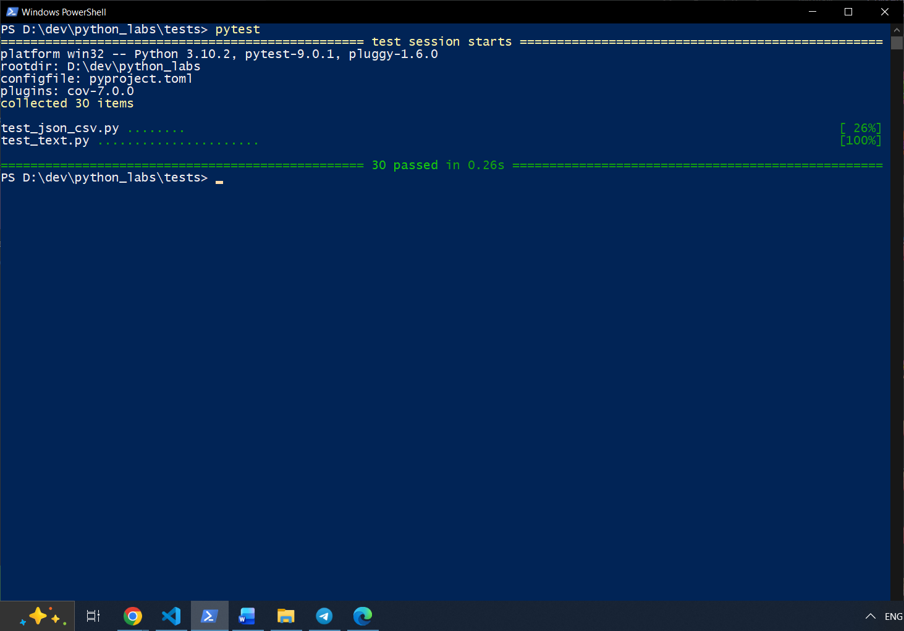

## C. Стиль кода (black)

Отформатировала код в стиле black.

### Результат проверки стиля:
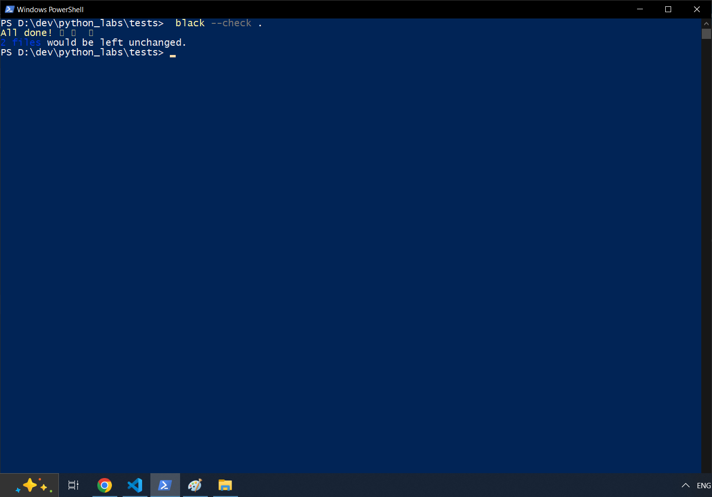