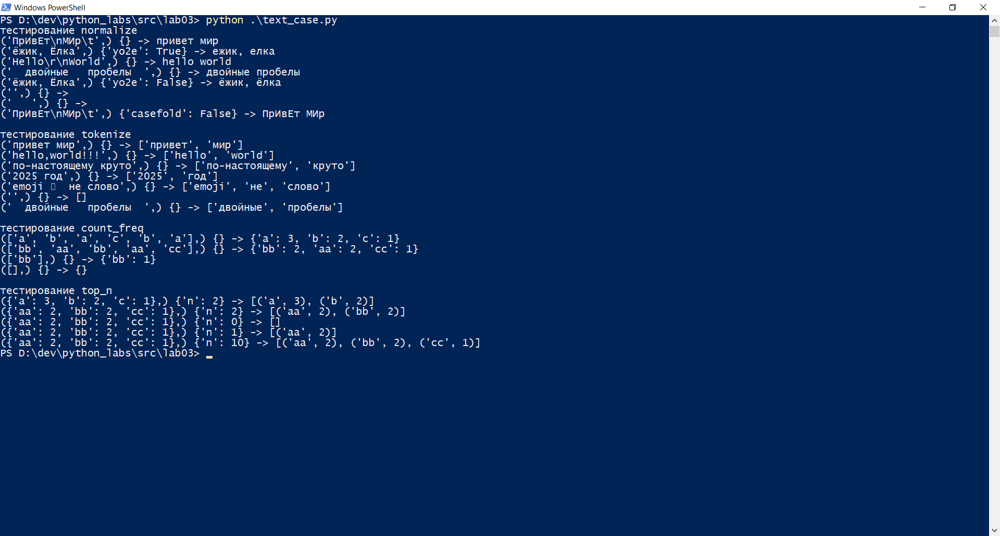

# Лабораторная работа 3
## Задание A — src/lib/text.py
В первом задании я реализую 4 функции: "очистка" текста, разделение входного текста на список слов по небуквенно-цифровым разделителям, подсчет частоты появления каждого слова в списке и  возврат списка из n самых частых слов.
Вот код к этому заданию.

```
def normalize(text: str, *, casefold: bool = True, yo2e: bool = True) -> str:
    """
    Эта функция "очищает" текст: приводит к нижнему регистру, заменяет ё на е, убирает лишние управляющие символы и пробелы.
    """
    if casefold:
        s = text.casefold()
    else:
        s = text
    res = []
    words = s.split()
    for word in words:
        new_word = ""
        for i in range(len(word)):
            if yo2e and word[i] == "ё":
                new_word += "е"
            else:
                new_word += word[i]
        res.append(new_word)
    
    return " ".join(res)

def is_word_symb(symb):
    """
    Эта функция проверяет, является ли символ допустимым для слова.
    """
    return symb.isalpha() or symb.isdigit() or symb == "_"

def tokenize(text: str) -> list[str]:
    """
    Эта функция разбивает входной текст на список слов по небуквенно-цифровым разделителям.
    """
    res = ""
    for i in range(len(text)):
        s = text[i]
        if is_word_symb(s):
            res += s
        elif s == "-":
            x = " "

            if i > 0 and i < len(text) - 1:
                f = text[i-1]
                a = text[i+1]
                if is_word_symb(f) and is_word_symb(a):
                    x = s
            
            res += x
        else:
            res += " "
    return res.split()


def count_freq(tokens: list[str]) -> dict[str, int]:
    """
    Эта функция подсчитывает частоту появления каждого слова в списке.
    """
    my_dict = {}
    for i in tokens:
        if i in my_dict:
            my_dict[i] += 1
        else:
            my_dict[i] = 1
    return my_dict

def top_n(freq: dict[str, int], n: int = 5) -> list[tuple[str, int]]:
    """
    Эта функция возвращает список из n самых частых слов.
    """
    def my_sort(elem):
        return(-elem[1], elem[0])
    
    res = sorted(freq.items(), key=my_sort)
    return res[:n]

```



## Задание b - src/text_stats.py
Во втором задании скрипт читает одну строку текста из stdin, вызывает функции из lib/text.py и печатает:
Всего слов: <N>
Уникальных слов: <K>
Топ-5: — по строке на запись в формате слово:кол-во (по убыванию, как в top_n).

Вот код к этому заданию.

```
import sys
sys.path.append("../lib")
from text import *

text = input()
norm_text = normalize(text)
tokenz = tokenize(norm_text)
freqs = count_freq(tokenz)
top_5 = top_n(freqs, n=5)
print(f"Всего слов: {len(tokenz)}")
print(f"Уникальных слов: {len(freqs.keys())}")
print(f"Топ-5:")
for i in top_5:
    print(f"{i[0]}:{i[1]}")
```


