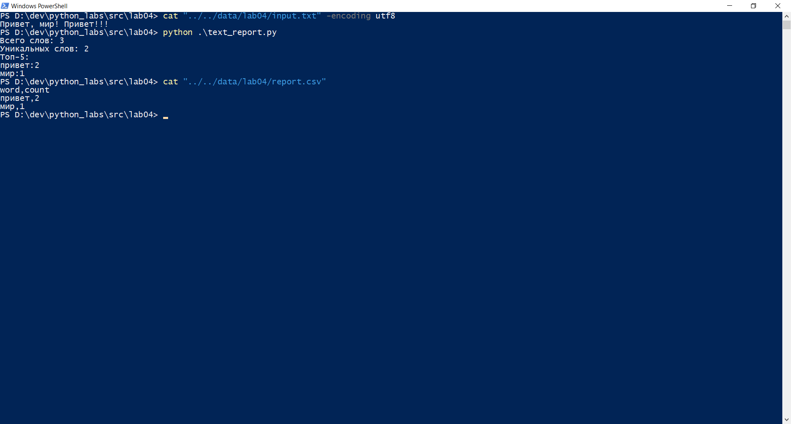
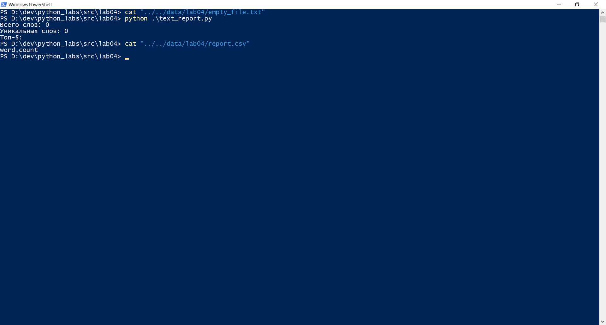

# Лабораторная работа 4
## Задание A — модуль src/lab04/io_txt_csv.py

В этом задании я реаизовала функции read_text и write_csv. Первая функция считывает текст, а вторая создает csv-файл.
Вот код к этому заданию.

```
from pathlib import Path

def read_text(path: str | Path, encoding: str = "utf-8") -> str:
    """
    Эта функция читает текст. Для выбора другой кодировки используйте аргумент encoding. Например encoding = "cp1251".
    Сейчас содержимое файла считывается целиком и вовзращается в одной переменной, но в реальных задачах нужно сделать 
    построчную обработку информации, иначе может не хватить памяти.
    """
    p = Path(path)
    # FileNotFoundError и UnicodeDecodeError пусть «всплывают» — это нормально
    return p.read_text(encoding=encoding)

import csv
from pathlib import Path
from typing import Iterable, Sequence

def write_csv(rows: Iterable[Sequence], path: str | Path,
              header: tuple[str, ...] | None = None, encoding: str = "utf-8") -> None:
    """
    Эта функция создает csv-файл, в который записывает заголовок (если есть), а потом строки данных.
    Для выбора другой кодировки используйте аргумент encoding. Например encoding = "cp1251".
    """
    p = Path(path)
    rows = list(rows)
    if len(rows) != 0:
        cnt_elem = len(rows[0])
    else:
        cnt_elem = 0
    with p.open("w", newline="", encoding=encoding) as f:
        w = csv.writer(f)
        if header is not None:
            w.writerow(header)
        for r in rows:
            if len(r) != cnt_elem:
                raise ValueError()
            w.writerow(r)
```

Написала тест-кейсы в отдельном файле test_io_txt_csv.py. Вот он:


```
import csv
import os
from io_txt_csv import read_text, write_csv

print("проверка, что возвращается одна строка")
txt2 = read_text("../../data/lab04/input2.txt")
assert type(txt2) == str

print("проверка, что если файл не найден — поднимается FileNotFoundError")
try:
    read_text("../../data/lab04/input3.txt")
    assert False
except FileNotFoundError:
    print("read_txt вызван для несуществующего файла, поймано исключение FileNotFoundError, как и ожидалось ")

print("проверка, что если кодировка не та, поднимается UnicodeDecodeError")
try:
    read_text("../../data/lab04/test-cp1251.txt", encoding = "utf-8")
    assert False
except UnicodeDecodeError:
    print("указана кодировка utf-8, а файл записан в кодировке cp1251, поймано исключение UnicodeDecodeError, как и ожидалось")

print("проверка, что при обработке пустого файла выведется пустая строка")
txt_em = read_text("../../data/lab04/empty_file.txt")
assert txt_em == ""

print("проверка, что csv-файл создается с разделителем запятая")
write_csv([("word","count"),("test",3)], "../../data/lab04/check01.csv")
with open("../../data/lab04/check01.csv") as f:
    r = csv.reader(f, delimiter=",")
    for row in r:
        assert len(row) == 2

print("проверка, что если передан header, то он запишется первой строкой")
write_csv([("word","count"),("test",3)], "../../data/lab04/check02.csv", header=("h1", "h2"))
with open("../../data/lab04/check02.csv") as f:
    r = csv.reader(f)
    for row in r:
        assert row == ["h1",  "h2"], row
        break

print("проверка, что все строки имеют одинаковую длину, а если нет, то поднимается ValueError")
try:
    write_csv([("word","count"),("test",3, "elem1")], "../../data/lab04/check03.csv")
    assert False
except ValueError:
    print("write_csv вызвано со строчками разной длины, перехвачено ValueError, как и ожидалось")

print("проверка, что если rows пустой, то формируется пустой csv файл")
write_csv([], "../../data/lab04/check04.csv")
txt3 = read_text("../../data/lab04/check04.csv")
assert txt3 == ""

print("проверка, что если файл с header=(a,b), то файл содержит только заголовок")
write_csv([], "../../data/lab04/check05.csv", header=("a", "b"))
with open("../../data/lab04/check05.csv") as f:
    r = csv.reader(f)
    for row in r:
        assert row == ["a", "b"] 

```
### Вот результат их выполения:


## Задание b - скрипт src/lab04/text_report.py
Написала скрипт, который:  
- Читает один входной файл data/input.txt (сейчас название файла с входынми данными хранится в переменной f_name).  
- Нормализует текст (lib/text.py), токенизирует и считает частоты слов.  
- Сохраняет data/report.csv c колонками: word,count, отсортированными: count ↓, слово ↑ (при равенстве).  
- В консоль печатает краткое резюме:  
Всего слов: N  
Уникальных слов: K  
Топ-5:   
- Также есть переменные, которые управляют кодировкой входного файла и csv-отчета: input_encoding и output_encoding.

Вот код к этому заданию:

```
import sys
sys.path.append("../lib")
from text import *
from io_txt_csv import read_text, write_csv
# f_name = "../../data/lab04/input.txt"
# f_name = "../../data/lab04/empty_file.txt"
f_name = "../../data/lab04/test-cp1251.txt"
# input_encoding = "utf-8"
input_encoding = "cp1251"
# output_encoding = "utf-8"
output_encoding = "cp1251"
try:
    text = read_text(f_name, encoding=input_encoding)
except FileNotFoundError:
    print(f"Файла {f_name} не существует")
    sys.exit(1)


norm_text = normalize(text)
tokenz = tokenize(norm_text)
freqs = count_freq(tokenz)
top_5 = top_n(freqs, n=5)

rows = freqs.items()

def my_sort(elem):
    return(-elem[1], elem[0])

rows = sorted(rows, key=my_sort)
write_csv(rows, "../../data/lab04/report.csv", encoding = output_encoding, header=("word", "count"))

print(f"Всего слов: {len(tokenz)}")
print(f"Уникальных слов: {len(freqs.keys())}")
print(f"Топ-5:")
for i in top_5:
    print(f"{i[0]}:{i[1]}")
```
### Пример запуска с обычным файлом:



### Пример запуска с пустым файлом:



### Пример запуска с кодировкой cp1251:


