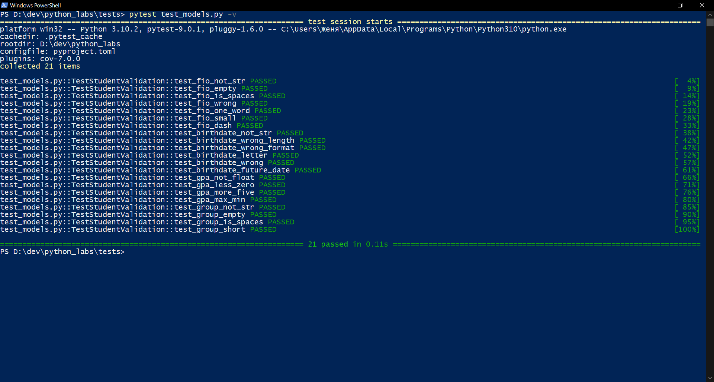
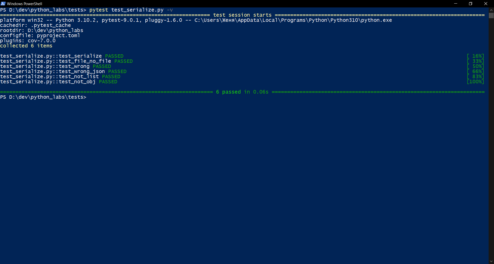
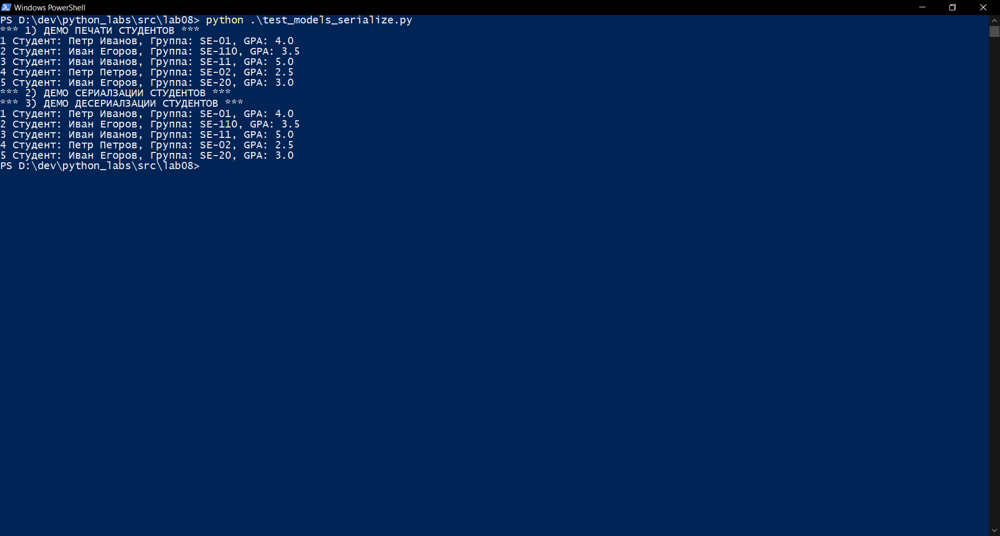
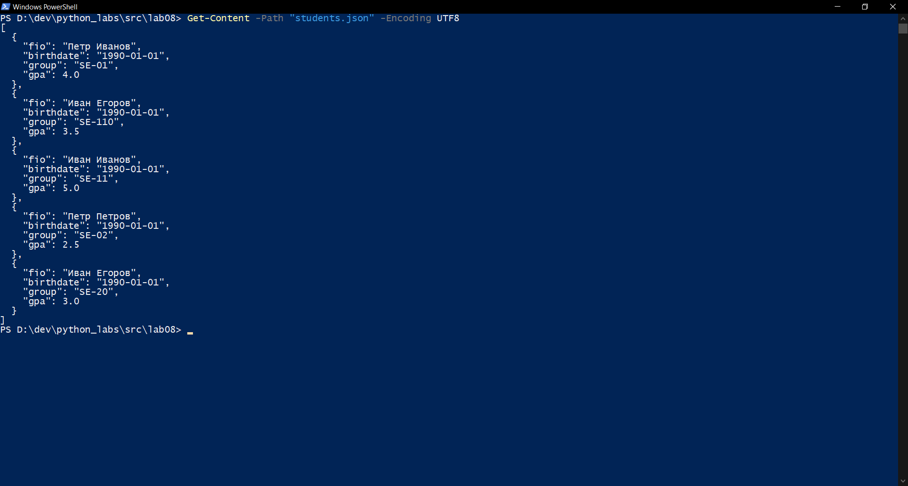

# Лабораторная работа 8
## A. Student (models.py)

В этом задании:
* Реализовала класс Student
* Добавила поля для хранения основных данных: ФИО, даты рождения, группы и gpa
* В методе __post_init__ добавила валидацию, чтобы дата имела правильный формат, а gpa находился в диапазоне от 0 до 5
* Создала методы для расчёта возраста студента (age()), для преобразования объекта в словарь (to_dict()) и обратно (from_dict()) для сериализации данных, 
* Cоздала метод __str__() для красивого вывода информации о студенте

Вот код к этому заданию:

```
from dataclasses import *
from datetime import *

@dataclass
class Student:
    fio: str
    birthdate: str
    group: str
    gpa: float

    def __post_init__(self):
        self._validate_fio()
        self._validate_birthdate()
        self._validate_group()
        self._validate_gpa()

    def _validate_fio(self):

        '''Функция для валидации ФИО'''

        if not isinstance(self.fio, str):
            raise TypeError("ФИО должно быть строкой")
        
        if len(self.fio.strip()) == 0:
            raise TypeError("ФИО не может быть пустым")
        
        for symb in self.fio:
            if not(symb.isalpha() or symb.isspace() or symb == "-"):
                raise TypeError("ФИО может содержать только буквы, пробелы и дефис")
            
        fio_parts = self.fio.split()
        if len(fio_parts) < 2:
            raise TypeError("ФИО должно содержать минимум 2 слова(имя и фамилия)")
        
        for fio_part in fio_parts:
            if not fio_part[0].isupper():
                raise TypeError("Каждое слово в ФИО должно начинаться с заглавной буквы")

    def _validate_birthdate(self):

        '''Валидация даты рождения''' 

        if not isinstance(self.birthdate, str):
            raise ValueError("Дата рождения должна быть строкой")
        
        if len(self.birthdate) != 10:
            raise ValueError("Дата рождения должна быть формата yyyy-mm-dd")
        
        if self.birthdate[4] != "-" or self.birthdate[7] != "-":
            raise ValueError("Дата рождения должна быть формата yyyy-mm-dd")
        
        year_part = self.birthdate[0:4]
        month_part = self.birthdate[5:7]
        day_part = self.birthdate[8:10]
        if not(year_part.isdigit() and month_part.isdigit() and day_part.isdigit()):
            raise TypeError("Дата рождения может содержать только ццифры")
                
        try:
            birth_date = datetime.strptime(self.birthdate, "%Y-%m-%d").date()
        except ValueError:
            raise ValueError("Некорректная дата рождения")
        
        today = date.today()
        if birth_date > today:
            raise ValueError("Дата рождения не может быть в будущем")
        
            
    def _validate_gpa(self):
        
        '''Валидация gpa'''        

        if not isinstance(self.gpa, float):
            raise ValueError("Оценка должна быть дробным числом")  
          
        if not (0 <= self.gpa <= 5):
            raise ValueError("Оценка должна быть от 0 до 5")
        
    def _validate_group(self):

        '''Валидация номера группы'''

        if not isinstance(self.group, str):
            raise TypeError("Группа должна быть строкой")
        
        if not self.group.strip():
            raise ValueError("Группа не может быть пустой")
        
        if len(self.group) < 5:
            raise ValueError("Группа слишком короткая")

    def age(self) -> int:

    '''Расчет возраста студента'''

        birth_date = datetime.strptime(self.birthdate, "%Y-%m-%d").date()
        today = date.today()
        age = today.year - birth_date.year
        if today.month < birth_date.month or (today.month == birth_date.month and today.day < birth_date.day):
            age -= 1       
        return age

    def to_dict(self) -> dict:

        '''Проверка полноценности полей'''
        
        if not self.fio or not self.fio.strip():
            raise ValueError("Поле 'fio' не может быть пустым")
        
        if not self.birthdate or not self.birthdate.strip():
            raise ValueError("Поле 'birthdate' не может быть пустым")
        
        if not self.group or not self.group.strip():
            raise ValueError("Поле 'group' не может быть пустым")
        
        if self.gpa is None:
            raise ValueError("Поле 'gpa' не может быть None")
        
        return {
            "fio": self.fio,
            "birthdate": self.birthdate,
            "group": self.group,
            "gpa": self.gpa
        }

    @classmethod
    def from_dict(cls, d: dict):

        '''Десериализация из словаря'''

        return cls(
            fio=d['fio'],
            birthdate=d['birthdate'],
            group=d['group'],
            gpa=d['gpa']
        )

    def __str__(self):

        '''Строковое представление объекта'''

        return f"Студент: {self.fio}, Группа: {self.group}, GPA: {self.gpa}"
```
Выполнение тестов:




## B. serialize.py
Реализовала модуль serialize.py:
* students_to_json(students, path): сохраняет список студентов в JSON.
* students_from_json(path) -> list[Student]: читает JSON-массив, валидирует, создаёт список Student

Вот код к этому заданию:
```
import json
from pathlib import Path
from models import *


def students_to_json(students, path):

    json_file = Path(path)

    if not str(json_file).endswith(".json"):
        raise ValueError("неверный тип файла, файл должен иметь расширение json")

    if not isinstance(students, list):
        raise TypeError("students должно быть списком объектов.")

    for s in students:
        if not isinstance(s, Student):
            raise TypeError("все элементы списка должны быть объектами Student.")

    data = []
    for s in students:
        data.append(s.to_dict())

    with open(path, "w", encoding="utf-8") as f:
        json.dump(data, f, ensure_ascii=False, indent=2)


def students_from_json(path):

    json_file = Path(path)

    if not str(json_file).endswith(".json"):
        raise ValueError("неверный тип файла, файл должен иметь расширение json")
    
    if not json_file.exists(): 
        raise FileNotFoundError("файл не найден")

    with open(json_file, 'r', encoding='utf-8') as f:
        try:
            data = json.load(f)
        except json.JSONDecodeError:
            raise ValueError("некорректный формат json-файла")
        except UnicodeDecodeError:
            raise ValueError("Некорректная кодировка файла")

    if not isinstance(data, list):
        raise TypeError("json-файл должен содержать список студентов.")

    students = []
    for item in data:
        if not isinstance(item, dict):
            raise TypeError("каждый студент в json-файле должен быть словарем.")
        students.append(Student.from_dict(item))

    return students
```
Выполнение тестов:



## Результаты работы models и serialize:


