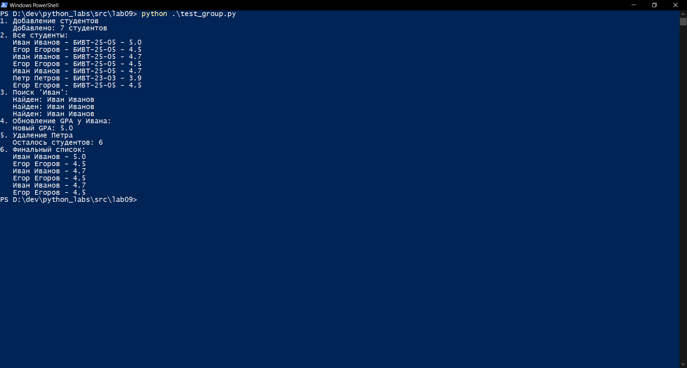
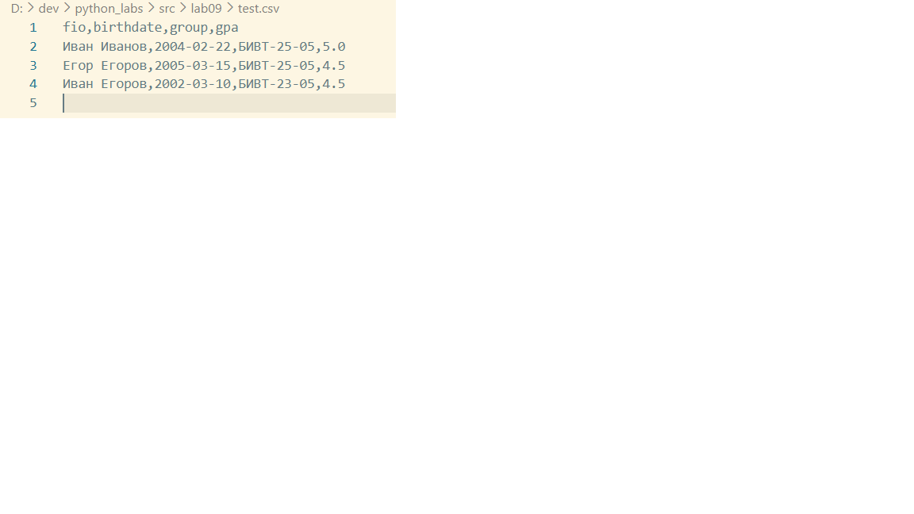

# Лабораторная работа 9
## src/lab09/group.py

Реализовала класс Group, реализующий CRUD-операции над студентами:

методы:
* add(student: Student) — добавление студента
* list() -> list[Student] — получить всех студентов
* find(substr: str) — поиск по подстроке в ФИО
* remove(fio: str) — удаление по ФИО
* update(fio: str, **fields) — обновление полей существующей записи

Вот код к этому заданию:
```
import csv
import sys
from pathlib import Path
sys.path.append("../lab08")
from models import Student

class Group:
    def __init__(self, storage_path: str):
        self.path = Path(storage_path)
        if not self.path.exists() or self.path.stat().st_size == 0:
            self.path.parent.mkdir(parents=True, exist_ok=True)
            with self.path.open("w", encoding="utf-8", newline="") as f:
                writer = csv.DictWriter(f, fieldnames=["fio", "birthdate", "group", "gpa"])
                writer.writeheader()

    def _read_all(self):
        students = []
        with self.path.open("r", encoding="utf-8") as f:
            reader = csv.DictReader(f)
            for row in reader:
                students.append(
                    Student(
                        fio=row["fio"],
                        birthdate=row["birthdate"],
                        group=row["group"],
                        gpa=float(row["gpa"]),
                    )
                )
        return students 

    def list(self):
       return self._read_all()

    def add(self, student: Student):
        with self.path.open("a", newline="", encoding="utf-8") as f:
            writer = csv.writer(f)
            writer.writerow([student.fio, student.birthdate, student.group, student.gpa])

    def find(self, substr: str):
        students = self._read_all()
        found = []
        
        for student in students:
            if substr in student.fio:
                found.append(student)
        
        return found


    def remove(self, fio: str):
        students = self._read_all()
        
        for i in range(len(students)):
            if students[i].fio == fio:
                students.pop(i) 
                
                with self.path.open("w", newline="", encoding="utf-8") as f:
                    writer = csv.writer(f)
                    writer.writerow(["fio", "birthdate", "group", "gpa"])
                    for student in students:
                        writer.writerow([student.fio, student.birthdate, student.group, student.gpa])
                return True
        
        return False  
         

    def update(self, fio: str, **fields):
        students = self._read_all()
        updated = False
        
        for student in students:
            if student.fio == fio:
                if "fio" in fields:
                    student.fio = fields["fio"]
                if "birthdate" in fields:
                    student.birthdate = fields["birthdate"]
                if "group" in fields:
                    student.group = fields["group"]
                if "gpa" in fields:
                    student.gpa = float(fields["gpa"])
                updated = True
                break
        
        if updated:
            with self.path.open("w", newline="", encoding="utf-8") as f:
                writer = csv.writer(f)
                writer.writerow(["fio", "birthdate", "group", "gpa"])
                for student in students:
                    writer.writerow([student.fio, student.birthdate, student.group, student.gpa])
        
        return updated
```
### Выполнение тестов:



## Тесты

```
from group import Group
from models import Student

def test_group():
    group = Group("test.csv")
    
    s1 = Student("Иван Иванов", "2004-02-22", "БИВТ-25-05", 4.7)
    s2 = Student("Петр Петров", "2004-11-02", "БИВТ-23-03", 3.9)
    s3 = Student("Егор Егоров", "2005-03-15", "БИВТ-25-05", 4.5)
    s4 = Student("Иван Егоров", "2002-03-10", "БИВТ-23-05", 4.5)
    
    print("1. Добавление студентов")
    group.add(s1)
    group.add(s2)
    group.add(s3)
    group.add(s4)
    print(f"   Добавлено: {len(group.list())} студентов")
    
    print("2. Все студенты:")
    for student in group.list():
        print(f"   {student.fio} - {student.group} - {student.gpa}")
    
    print("3. Поиск 'Иван':")
    found = group.find("Иван")
    for student in found:
        print(f"   Найден: {student.fio}")
    
    print("4. Обновление GPA у Ивана:")
    group.update("Иван Иванов", gpa=5.0)
    ivan = group.find("Иван Иванов")[0]
    print(f"   Новый GPA: {ivan.gpa}")
    
    print("5. Удаление Петра")
    group.remove("Петр Петров")
    print(f"   Осталось студентов: {len(group.list())}")
    
    # Тест 6: Финальный вывод
    print("6. Финальный список:")
    for student in group.list():
        print(f"   {student.fio} - {student.gpa}")

test_group()
    g
```

### csv-файл

