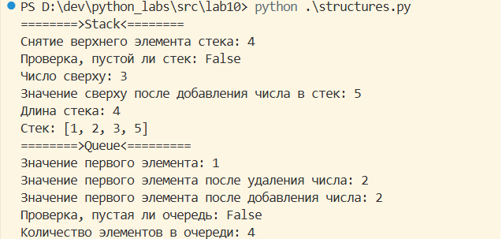

# Лабораторная работа 10
## src/lab10/structures.py

Стек - коллекция, элементы которой получают по принципу «последний вошел, первый вышел» (Last-In-First-Out).
Сложность типичных операций:
* push(item) - O(1)
* pop() - O(1)
* peek() - O(1)
* is_empty() O(1)
* len() - O(1)

Очередь - коллекция, элементы которой получают по принципу «первый вошел, первый вышел» (First-In-First-Out).
Сложность типичных операций:
* enqueue(item) - O(1)
* dequeue() - O(1)
* peek() - O(1)
* is_empty() - O(1)
* len() - O(1)

В этом задании я реализовала:
* class Stack — стек на базе list
* class Queue — очередь на базе collections.deque

```
from collections import deque

class Stack:
    """Стек на базе list."""
    
    def __init__(self):
        self._data = [] 
    
    def push(self, item):
        self._data.append(item)
    
    def pop(self):
        if self.is_empty():
            raise IndexError("Стек пустой")
        return self._data.pop()
    
    def peek(self):
        if self.is_empty():
            return None
        return self._data[-1]
    
    def is_empty(self):
        return len(self._data) == 0
    
    def __len__(self):
        return len(self._data)


class Queue:
    """Очередь на базе deque."""
    
    def __init__(self):
        self._data = deque()  
    
    def enqueue(self, item):
        self._data.append(item)
    
    def dequeue(self):
        if self.is_empty():
            raise IndexError("Очередь пустая")
        return self._data.popleft()
    
    def peek(self):
        if self.is_empty():
            return None
        return self._data[0]
    
    def is_empty(self):
        return len(self._data) == 0
    
    def __len__(self):
        return len(self._data)
    

if __name__ == "__main__":
    print('========>Stack<========')
    
    stack = Stack()

    stack.push(1)
    stack.push(2)
    stack.push(3)
    stack.push(4)
    
    print(f'Снятие верхнего элемента стека: {stack.pop()}')
    print(f'Проверка, пустой ли стек: {stack.is_empty()}')
    print(f'Число сверху: {stack.peek()}')
    stack.push(5)
    print(f'Значение сверху после добавления числа в стек: {stack.peek()}')
    print(f'Длина стека: {len(stack)}')
    print(f'Стек: {stack._data}')
    
    print('========>Queue<=========')
    
    q = Queue()

    q.enqueue(1)
    q.enqueue(2)
    q.enqueue(3)
    q.enqueue(4)
    
    print(f'Значение первого элемента: {q.peek()}')
    q.dequeue()
    print(f'Значение первого элемента после удаления числа: {q.peek()}')
    q.enqueue(52)
    print(f'Значение первого элемента после добавления числа: {q.peek()}')
    print(f'Проверка, пустая ли очередь: {q.is_empty()}')
    print(f'Количество элементов в очереди: {len(q)}')
```
### Выполнение тестов:


## src/lab10/linked_list.py

Связный список - динамическая структура данных, состоящая из узлов, где каждый узел содержит данные и ссылку на следующий узел.
Сложность типичных операций:
* append(value) - O(n) (нужно пройти весь список)
* prepend(value) - O(1) (просто меняем head)
* insert(idx, value) - O(n) (нужно дойти до нужной позиции)
* remove(value) - O(n) (нужно найти элемент)
* iter() - O(n)
* len() - O(1)

В этом задании я реализовала:
* class Node
* class SinglyLinkedList

Вот код к этому заданию:
```
class Node:
    def __init__(self, value):
        self.value = value
        self.next = None


class SinglyLinkedList:
    def __init__(self):
        self.head = None
        self._size = 0
    
    def append(self, value):
        new_node = Node(value)
        if not self.head:
            self.head = new_node
        else:
            current = self.head
            while current.next:
                current = current.next
            current.next = new_node
        self._size += 1
    
    def prepend(self, value):
        new_node = Node(value)
        new_node.next = self.head
        self.head = new_node
        self._size += 1
    
    def insert(self, idx, value):
        if idx < 0 or idx > self._size:
            raise IndexError("Индекс вне диапазона")
        
        if idx == 0:
            self.prepend(value)
        elif idx == self._size:
            self.append(value)
        else:
            new_node = Node(value)
            current = self.head
            for _ in range(idx - 1):
                current = current.next
            new_node.next = current.next
            current.next = new_node
            self._size += 1
    
    def remove(self, value):
        if not self.head:
            return
        
        if self.head.value == value:
            self.head = self.head.next
            self._size -= 1
            return
        
        current = self.head
        while current.next and current.next.value != value:
            current = current.next
        
        if current.next:
            current.next = current.next.next
            self._size -= 1
    
    def __iter__(self):
        current = self.head
        while current:
            yield current.value
            current = current.next
    
    def __len__(self):
        return self._size


if __name__ == "__main__":
    lst = SinglyLinkedList()
    
    lst.append(1)
    lst.append(2)
    lst.append(3)
    print(f"Добавили элементы в пустой список: {list(lst)}")
    
    lst.prepend(0)
    print(f"Добавили ноль в начало списка: {list(lst)}")

    lst.insert(2, 1.5)
    print(f"Вставили новый элемент на позицию 2: {list(lst)}")
    
    lst.remove(2)
    print(f"Убрали 2: {list(lst)}")
    
    print("Длина:", len(lst))
```
### Выполнение тестов:
